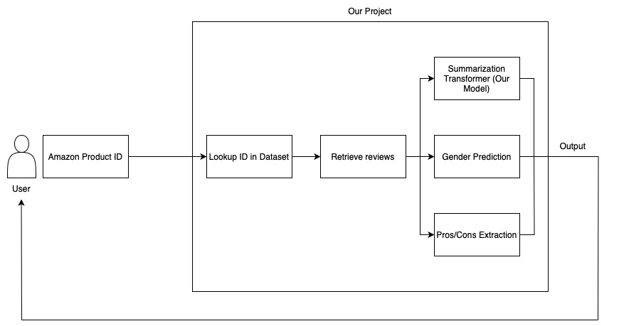

# Amazon Review Analysis

## Project Overview

This project performs structured analysis of Amazon product reviews. Given a **product ID**, it retrieves and processes reviews to extract:

-   A summary of review content
-   Pros and cons using rule-based NLP
-   Gender demographics of reviewers to help infer the product’s target audience

---

## Demo Link

[Demo Video]([url](https://www.youtube.com/watch?v=_jTdBLmkMC8))

---

## Core Architecture



-   **Custom Transformer**

    -   Implemented in PyTorch from the ground up
    -   Includes positional encoding, multi-head attention, and scaled dot-product attention

-   **Rule-Based Pros/Cons Extraction**

    -   Uses part-of-speech tagging and simple heuristics
    -   Focuses on explainability over complexity

-   **Gender Prediction**
    -   The gender of the reviewer is predicted based on their first name using a lookup-based model trained on common name-gender associations.

-   **Main App GUI**
    -   Application was implemented using Streamlit, version 1.45.0

---

## Setup

1. **Install dependencies (Python 3.12)**

```bash
pip install -r requirements.txt
```

2. **Install spaCy English model**

```bash
python -m spacy download en_core_web_sm
```

3. **Run the project**

Run the app with GUI:

```bash
streamlit run app.py
```

Or open and execute the notebook:

```bash
review_analysis.ipynb
```

---

## Folder Structure

```
AMAZON-REVIEW-ANALYSIS/
│
├── drafts/                    # Prototypes and exploratory scripts
├── app.py                     # Main application
├── review_analysis.ipynb      # Main notebook
├── gender_predictor.pkl       # Gender prediction model
├── transformer_summarizer.pth # Our saved transformer-based summarization model
├── requirements.txt           # Requirements
├── Reviews.csv                # Dataset: Download from link provided below
└── README.md
```

---

## Dataset

We used the following dataset which has 500K+ Amazon product reviews:  
[Kaggle - Amazon Product Reviews](https://www.kaggle.com/datasets/arhamrumi/amazon-product-reviews)

---

## Acknowledgments

Gender prediction uses the [Name-Gender-Predictor](https://github.com/imshibl/Name-Gender-Predictor) by [Imshibl](https://github.com/imshibl)
